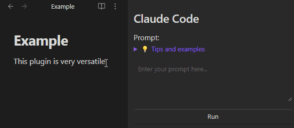
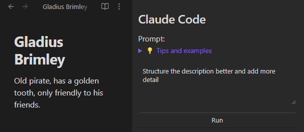

# Obsidian AI CLI

An Obsidian plugin that integrates multiple AI CLI tools directly into your workspace. Execute AI commands through convenient sidebar panels while automatically passing file context and selected text.



**Supported AI Tools:**
- Claude Code CLI
- Gemini CLI
- OpenAI Codex
- Qwen Code

## Features

- **Multi-AI Integration**: Access Claude Code, Gemini CLI, OpenAI Codex, and Qwen Code from dedicated sidebar panels
- **Automatic Context Passing**: Current file and selected text are automatically included in prompts
- **File Reference Support**: Use `@filename.md` syntax to reference other files in your vault
- **Split Output Display**: Clean result view with collapsible command execution details
- **Real-time Streaming**: See AI responses as they're generated
- **Custom Icons**: Distinctive icons for each AI tool in the sidebar

## Donate

If you find this plugin helpful, consider supporting its development:

[](https://paypal.me/blackdragonbe)

## Prerequisites

Before using this plugin, you need to have the CLI tools installed:

### Claude Code CLI
- Install from: https://claude.ai/code
- Ensure it's accessible via the `claude` command in your terminal
- Test with: `claude --version`

### Gemini CLI (Optional)
- Install the Gemini CLI tool
- Ensure it's accessible via the `gemini` command in your terminal  
- Test with: `gemini --version`

### OpenAI Codex (Optional)
- Install the OpenAI Codex CLI tool
- Ensure it's accessible via the `codex` command in your terminal
- Test with: `codex --version`

### Qwen Code (Optional)
- Install the Qwen Code CLI tool
- Ensure it's accessible via the `qwen` command in your terminal
- Test with: `qwen --version`

## Installation

### Option 1: Manual Installation (Recommended for Development)

1. Clone or download this repository
2. Copy the plugin folder to your Obsidian vault's plugins directory:
   ```
   YourVault/.obsidian/plugins/Obsidian-AI-CLI/
   ```
3. Navigate to the plugin directory and build:
   ```bash
   cd YourVault/.obsidian/plugins/Obsidian-AI-CLI/
   npm install
   npm run build
   ```
4. In Obsidian, go to Settings → Community Plugins
5. Enable "Obsidian AI CLI"

### Option 2: BRAT Installation (Recommended for regular use)

1. Install the BRAT plugin from the Community Plugins store
2. Add this repository URL to BRAT
3. Install and enable the plugin

## Setup

### 1. Configure CLI Paths

1. Go to Settings → Community Plugins → Obsidian AI CLI → Options
2. Set the paths for your CLI tools:
   - **Claude Code Path**: Usually `claude` (if in PATH) or full path to executable
   - **Gemini CLI Path**: Usually `gemini` (if in PATH) or full path to executable
   - **OpenAI Codex Path**: Usually `codex` (if in PATH) or full path to executable
   - **Qwen Code Path**: Usually `qwen` (if in PATH) or full path to executable
3. Use the "Test" buttons to verify each tool is working

### 2. Open Sidebar Panels

Use the command palette (Ctrl/Cmd + P) and search for:
- "Claude Code" - Opens the Claude Code sidebar panel
- "Gemini CLI" - Opens the Gemini CLI sidebar panel
- "OpenAI Codex" - Opens the OpenAI Codex sidebar panel
- "Qwen Code" - Opens the Qwen Code sidebar panel

Or use the sidebar icons that appear after enabling the plugin.

## Usage

### Basic Usage



1. **Open a file** and/or **select text** you want to work with
2. **Open a sidebar panel** (Claude Code, Gemini CLI, OpenAI Codex, or Qwen Code)
3. **Enter your prompt** in the text area
4. **Click Run** to execute

The plugin automatically:
- Detects your current file and adds it as `@filename.md`
- Includes selected text as context
- Displays the AI response in the "Result" section
- Shows command execution details and full prompt content in the collapsible section
- Uses stdin for robust handling of complex text with special characters

### Advanced Features

#### File References
Reference other files in your prompts using `@` syntax:
```
Summarize the main points from @meeting-notes.md and @project-plan.md
```

#### Context Display
The "Context" section shows:
- 📄 Current file being referenced
- ✏️ Selected text (if any)

#### Split Output
- **Result**: Clean AI response, always visible
- **Command Execution**: Technical details, collapsed by default

### Example Prompts

- `Translate the selected text to French`
- `Fix grammar and spelling in this document`
- `Summarize the key points from @project-notes.md`
- `Create a todo list based on this meeting transcript`
- `Explain this code and suggest improvements`

## Troubleshooting

### CLI Tool Not Found
**Error**: "CLI tool not found. Check the path in settings."

**Solutions**:
1. Verify the CLI tool is installed and working in your terminal
2. Check the path in plugin settings
3. Try using the full path to the executable instead of just the command name
4. Restart Obsidian after changing settings

### No Context Detected
**Issue**: Plugin doesn't detect current file or selection

**Solutions**:
1. Click in the prompt text area to refresh context
2. Try switching to another file and back
3. Ensure you're in a markdown view (not reading mode)

### Gemini Shows "Loaded cached credentials"
This is automatically filtered out in the Result section but remains visible in Command Execution for debugging.

### Icons Not Showing
1. Disable and re-enable the plugin
2. Restart Obsidian
3. Check the browser console for any errors

## Configuration

### Settings Options

- **Claude Code Path**: Path to Claude Code CLI executable
- **Gemini CLI Path**: Path to Gemini CLI executable
- **OpenAI Codex Path**: Path to OpenAI Codex CLI executable
- **Qwen Code Path**: Path to Qwen Code CLI executable

### File Structure
```
.obsidian/plugins/Obsidian-AI-CLI/
├── main.ts          # Main plugin code
├── manifest.json    # Plugin metadata
├── versions.json    # Version history
├── package.json     # Dependencies
├── CLAUDE.md        # Development notes
└── README.md        # This file
```

## Development

### Building from Source
```bash
npm install
npm run dev    # Development build with watch
npm run build  # Production build
```

### Architecture Notes
- **Unified View System**: Single `ToolView` class handles all AI tools
- **Context Detection**: Multiple fallback methods for file/selection detection
- **Process Management**: Node.js spawn with proper cleanup and stdin handling
- **Real-time Streaming**: Live output updates during execution
- **Robust Input Handling**: All prompts use stdin to avoid shell escaping issues
- **Enhanced Logging**: Full visibility into prompt content and execution details

## Support

For issues, feature requests, or questions:
1. Check this README and troubleshooting section
2. Look for error messages in the browser console (F12)
3. Create an issue with detailed information about your setup

## License

Copyright (C) 2025 by BlackDragonBE

This plugin is licensed for non-commercial use only. You may use, copy, modify, and distribute this software for non-commercial purposes, provided that you give proper attribution to the original author (BlackDragonBE). Commercial use requires explicit written permission.

See the [LICENSE](LICENSE) file for full license terms.

---

Made with ❤️ for the Obsidian community